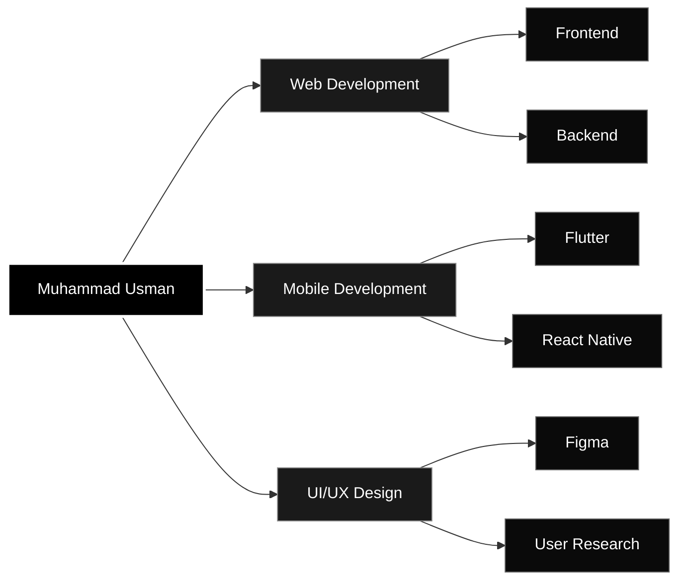

<div align="center">


<br/>


<br/>

```ascii
╔══════════════════════════════════════════════════════════════════════════════╗
║                                                                              ║
║    ██████╗ ███████╗██╗   ██╗███████╗██╗      ██████╗ ██████╗ ███████╗██████╗║
║    ██╔══██╗██╔════╝██║   ██║██╔════╝██║     ██╔═══██╗██╔══██╗██╔════╝██╔══██║
║    ██║  ██║█████╗  ██║   ██║█████╗  ██║     ██║   ██║██████╔╝█████╗  ██████╔║
║    ██║  ██║██╔══╝  ╚██╗ ██╔╝██╔══╝  ██║     ██║   ██║██╔═══╝ ██╔══╝  ██╔══██║
║    ██████╔╝███████╗ ╚████╔╝ ███████╗███████╗╚██████╔╝██║     ███████╗██║  ██║
║    ╚═════╝ ╚══════╝  ╚═══╝  ╚══════╝╚══════╝ ╚═════╝ ╚═╝     ╚══════╝╚═╝  ╚═╝
║                                                                              ║
╚══════════════════════════════════════════════════════════════════════════════╝
```


</div>

<br/>

## 🎯 CORE COMPETENCIES

<div align="center">



<table>
<tr>
<td align="center" width="33%" bgcolor="#000000">
<br/>
<br/>
<sub><b>⚡ Lightning-Fast • Scalable • Modern</b></sub>
</td>
<td align="center" width="33%" bgcolor="#000000">
<br/>
<br/>
<sub><b>📱 Cross-Platform • Native Performance</b></sub>
</td>
<td align="center" width="33%" bgcolor="#000000">
<br/>
<br/>
<sub><b>🎨 Pixel-Perfect • User-Centric</b></sub>
</td>
</tr>
</table>

</div>

<br/>

<p align="center">
  
</p>

<br/>

## 🛠️ TECHNOLOGY ARSENAL

<div align="center">

### ⚡ FRONTEND ENGINEERING


<br/>

### 📱 MOBILE DEVELOPMENT


<br/>

### 🔧 BACKEND & DATABASES


<br/>

### 🎨 DESIGN & DEVOPS


<br/>

```javascript
const techStack = {
  frontend: ["React", "Next.js", "TypeScript", "Tailwind CSS"],
  mobile: ["Flutter", "React Native", "Expo"],
  backend: ["Node.js", "Express", "MongoDB", "PostgreSQL"],
  tools: ["Figma", "Git", "Docker", "Vercel"],
  currentlyExploring: ["Three.js", "WebGL", "Motion Design"]
};
```

</div>

<br/>

<p align="center">
  
</p>

<br/>

<div align="center">

## 📊 GITHUB ANALYTICS


<br/><br/>


<br/><br/>


</div>

<br/>

<p align="center">
  
</p>

<br/>

<div align="center">

## 🌟 FEATURED PROJECT

<a href="https://usmans.vercel.app" target="_blank">
  
</a>

<br/><br/>


```typescript
interface Portfolio {
  architecture: "Modern & Modular";
  animations: "GSAP + Framer Motion";
  performance: "100/100 Lighthouse Score";
  features: ["Dark Mode", "Responsive", "Interactive"];
  deployment: "Vercel Edge Network";
}

const showcase: Portfolio = {
  architecture: "Modern & Modular",
  animations: "GSAP + Framer Motion",
  performance: "100/100 Lighthouse Score",
  features: ["Dark Mode", "Responsive", "Interactive"],
  deployment: "Vercel Edge Network"
};
```

</div>

<br/>

<p align="center">
  
</p>

<br/>

<div align="center">

## 🤝 CONNECT & COLLABORATE

<a href="https://www.linkedin.com/in/muhammad-usman-ahmed-/">
  
</a>
<a href="mailto:usmanahmed3377@gmail.com">
  
</a>
<a href="https://github.com/muhammadusmanahmedx">
  
</a>
<a href="https://usmans.vercel.app">
  
</a>

<br/><br/>


<br/><br/>

### 💼 OPEN FOR OPPORTUNITIES

```python
class Developer:
    def __init__(self):
        self.name = "Muhammad Usman Ahmed"
        self.role = "Full Stack Developer"
        self.location = "Rawalpindi, Pakistan"
        self.availability = "Open to Freelance & Full-time"
    
    def say_hi(self):
        print("Let's build something extraordinary together!")

me = Developer()
me.say_hi()
```

<br/>


</div>

<br/>

<div align="center">


<br/>


<br/>

**⭐ Crafted by [Muhammad Usman Ahmed](https://github.com/muhammadusmanahmedx) • 2024**

```ascii
╔════════════════════════════════════════════════════════════════╗
║  "Code is like humor. When you have to explain it, it's bad."  ║
║                        - Cory House                             ║
╚════════════════════════════════════════════════════════════════╝
```

</div>
